# Tweet, Tweet, Every Day Starts With A New Feed

* Find out my Twitter Feed, the relationship between what I followed, and the genre I am following. 

    * My Twitter Feed is mainly about pop culture, art, media, news, games, and food.

* Discover about my Timeline, Followers, and Following's Timelines.

    * My main interests are musicians, artists, designers, museums, games, entrepreneurs, and foods.
    
    * Summary Analysis:

        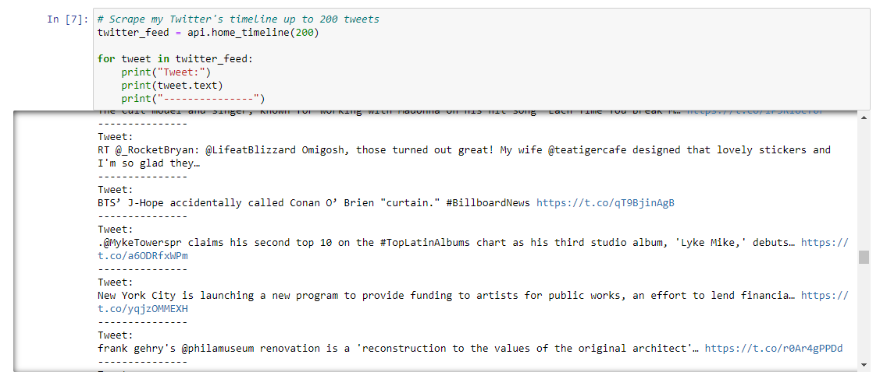
    
    * My Followings: 

        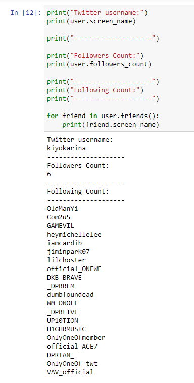

# Summary Analysis From Seven Notebooks:

* Overall, we find the latest popular tweets and the least popular tweets. And, discover which tweets engage the most audiences on Twitter.

* However, because of a hashtag, there are some unrelated tweets or tweets in another language included in the search results. 

* Most of the least popular tweets (Tweets with 0 Popularity Count) are Retweets from another user. However, there are some exceptions in each one of the notebooks. Not all of them are Retweets.   

* In summary, the popular tweets are mostly teasers, the music video-making process, and the new album's advertisements. 
    - There are exceptions in those top tweets. 
    - Some top tweets have a text with the artist's name and the song's title; however, they have included their selfie or texts that are not related to the artist's name or the song's title. 
    - The tweets themselves can talk about a completely different subject, not the idol groups, the artists, or the songs. 
    - Some popular or the least popular tweets talk about a random subject when the hashtag relates to weather or other things. For example, there is a tweet that talks about weather for the search term RAIN. 

# BTS Tweet Scraping  

* Engage tweets that talk about BTS(방탄소년단)'s newly released album called, "Butter."

    * **Number 1 Popular Tweet About Butter Teaser:**

    Date       | Tweet                                                                                 | Favorite Count
    ---------- | ------------------------------------------------------------------------------------- | --------------
    2021-05-11 | #BTS #방탄소년단 #BTS_Butter Teaser Photo 1 - 정국 (Jung Kook) https://t.co/7B0ACRi2rU | 1448291 

    - In this analysis, Jung Kook has the highest number of favorite (heart) counts compare to the rest of the members. 

    ---
    ## Top 5 Most Popular Tweets:

    **Popularity Count is several hearts counted in Twitter.**

    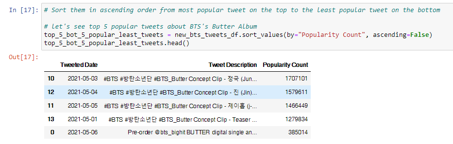

    ## Top 5 Least Popular Tweets:
    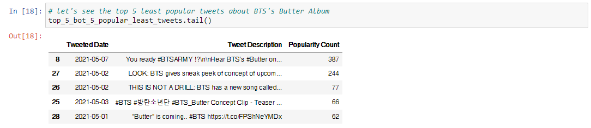

# Rain(비) Tweet Scraping 

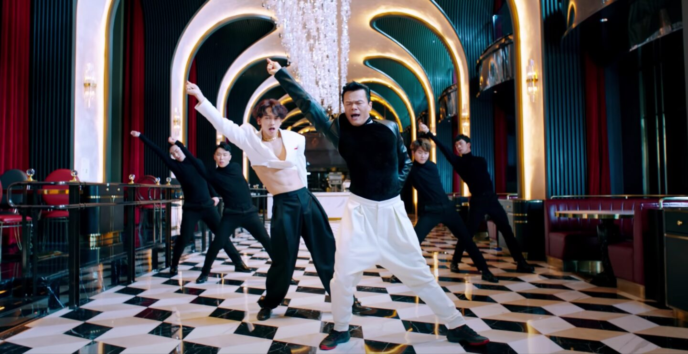

* Engage tweets that talk about Rain's newly released album called, "Switch To Me (Duet with JYP)," in Korean, 나로 바꾸자.
    
    * **Top Tweet in Korean:**

    Date       | Tweet                                                                                                                                         | Favorite Count
    ---------- | --------------------------------------------------------------------------------------------------------------------------------------------- | --------------
    2021-05-11 | ".@followjyp on MelOn Daily Chart (210510) 71. When We Disco (Duet with SUNMI) — 104,050 ULs [-2] 396. Switch to me… https://t.co/tGdHgZljGf" | 21

    * **Top Tweet in English:**

    Date       | Tweet                                           | Favorite Count
    ---------- | ----------------------------------------------- | --------------
    2021-05-07 | Switch to me- rain, jyp https://t.co/SGZpYLPS4Q | 83

    ---

    **Popularity Count is several hearts counted in Twitter.**
    
    ---

    ## Top 5 Most Popular Tweets | For search keyword results in *Korean*:
    
    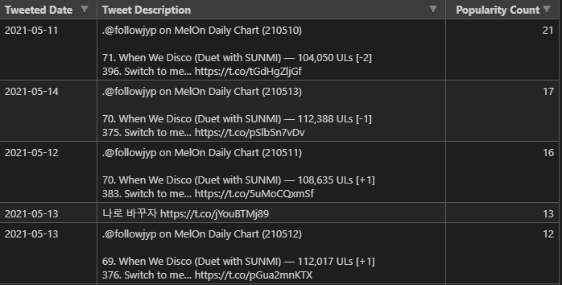

    ## Top 5 Least Popular Tweets | For search keyword results in *Korean*:
    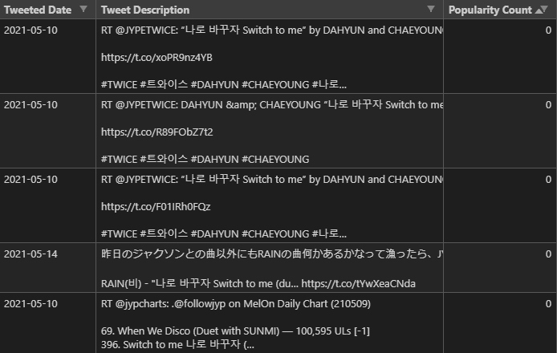

    ---

    ## Top 5 Most Popular Tweets | For search keyword results in *English*:

    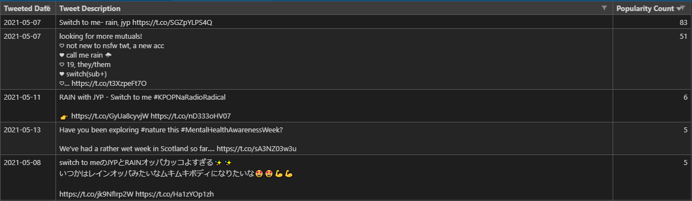

     ## Top 5 Least Popular Tweets | For search keyword results in *English*:
    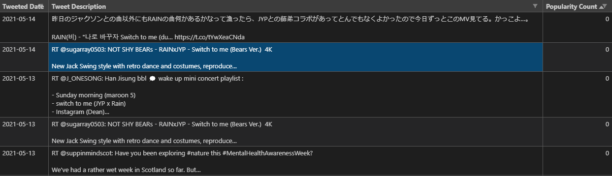

    - **Some of the tweets are in Japanese and Korean because of the English hashtag.**
    - Because the name "Rain" is a part of the weather climate, some unrelated tweets are included in the Top 5 and Bottom 5 Tweets.

# JYPE(박진영) Tweet Scraping 

* Engage tweets that talk about Jin Young Park (JYP) in both English and Korean.
    
    * **Top Tweet in Korean:**

    Date       | Tweet                                                                                                                                             | Favorite Count
    ---------- | ------------------------------------------------------------------------------------------------------------------------------------------------- | --------------
    2021-05-16 | [📺] 13살 나이로 오디션에 참가했던 #조권...☆ 박진영 VS 김문정 더 떨리는 오디션은?  KBS 210516 방송  (출처 : #사장님귀는당나귀귀  네이버TV) https://t.co/ONoVXpodb0 | 360

    * **Top Tweet in English:**

    Date       | Tweet                                           | Favorite Count
    ---------- | ----------------------------------------------- | --------------
    2021-05-20 | "TWICE ツウィ、JYPの副社長になる可能性も！？「突然ですが占ってもいいですか？」で星ひとみの分析に驚き https://t.co/Q7kHkOzMuV #TWICE #突然ですが占ってもいいですか" | 1704

    ---

    **Popularity Count is several hearts counted in Twitter.**
    
    ---

    ## Top 5 Most Popular Tweets | For search keyword results in *Korean*:
    
    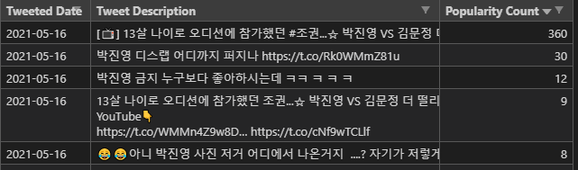

    ## Top 5 Least Popular Tweets | For search keyword results in *Korean*:
    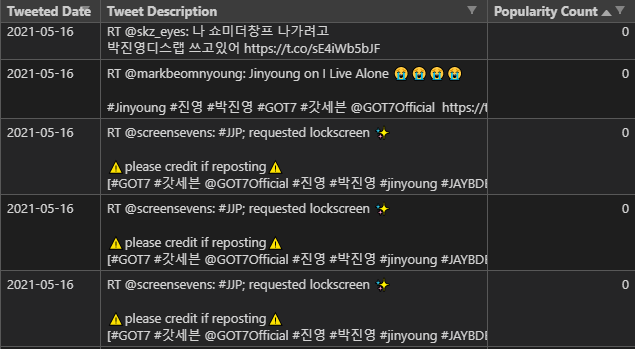

    ---

    ## Top 5 Most Popular Tweets | For search keyword results in *English*:

    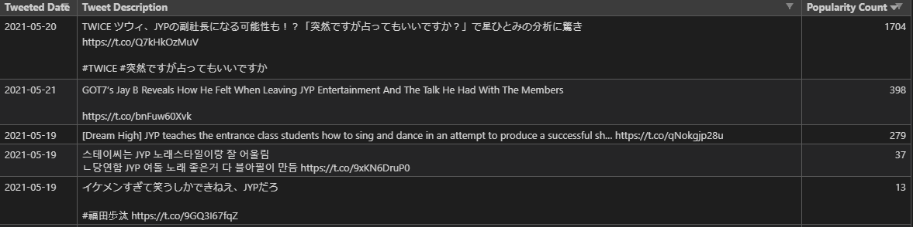

     ## Top 5 Least Popular Tweets | For search keyword results in *English*:
    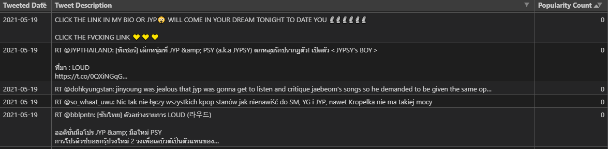

    
    * Some tweets in English result in Japanese because of the English hashtag.

# Sekai No Owari Tweet Scraping

* Engage tweets that talk about Sekai No Owari Japanese Band. 

    * **Number 1 Popular Tweet About Sekai No Owari Japanese Band:**

    Date       | Tweet                                                                                 | Favorite Count
    ---------- | ------------------------------------------------------------------------------------- | --------------
    2021-05-19 | あすのめざましテレビ気になる人がいたらRT♪　星野源　▽新垣結衣　▽BTS　▽SEKAI NO OWARI　▽大谷翔平　▽八村塁　💡内容変更の際はご了承ください。#めざましテレビ | 7305

    ---
    ## Top 5 Most Popular Tweets:

    **Popularity Count is several hearts counted in Twitter.**

    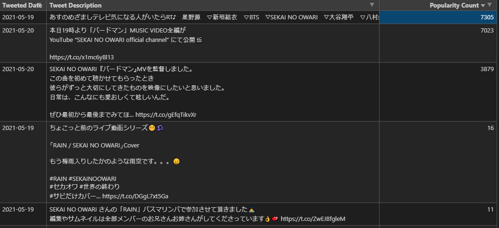

    ## Top 5 Least Popular Tweets:
    

# Ciipher Tweet Scraping

* Engage tweets that talk about a new trending K-idol boy group called Ciipher. 

    * **Number 1 Popular Tweet About Ciipher the new K-idol boy group:**

    Date       | Tweet                                                                                 | Favorite Count
    ---------- | ------------------------------------------------------------------------------------- | --------------
    2021-05-20 | "[#태그] 곰태그 다들 손 잘 씻고 계시죠?🐻 #Ciipher #싸이퍼 #ไซเฟอร์ https://t.co/zITMoqBG0e" | 6363

    ---
    ## Top 5 Most Popular Tweets:

    **Popularity Count is several hearts counted in Twitter.**

    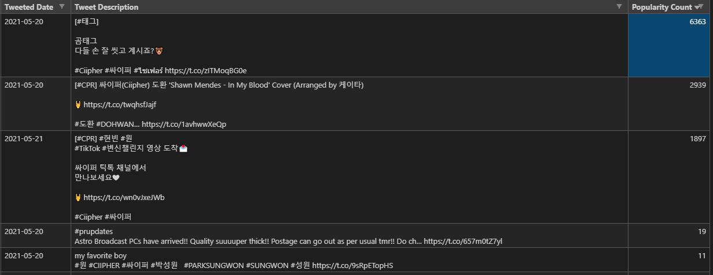

    ## Top 5 Least Popular Tweets:
    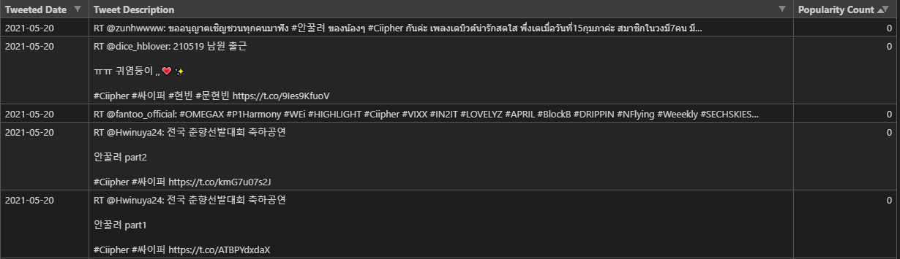

# NiziU Tweet Scraping

* Engage tweets that talk about NiziU Japanese Idol Girl Group. 

    * **Number 1 Popular Tweet About NiziU Japanese Idol Girl Group:**

    Date       | Tweet                                                                                 | Favorite Count
    ---------- | ------------------------------------------------------------------------------------- | --------------
    2021-05-20 | "NiziU 2nd Single 『Take a picture／Poppin’ Shakin’』 「Take a picture」MV Making Movie🎞 https://t.co/D4Qc5bfMci… https://t.co/Oh5arliws9" | 23964

    ---
    ## Top 5 Most Popular Tweets:

    **Popularity Count is several hearts counted in Twitter.**

    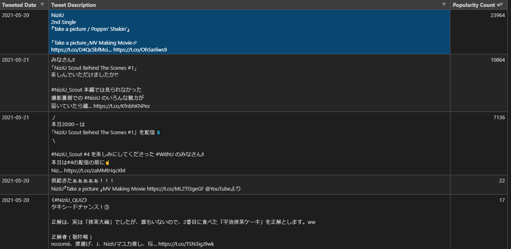

    ## Top 5 Least Popular Tweets:
    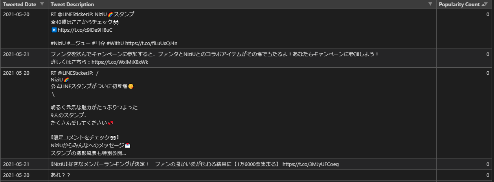

# Twice Tweet Scraping 

* Engage tweets that talk about TWICE the K-idol Girl Group. 

    * **Number 1 Popular Tweet About TWICE the K-idol Girl Group:**

    Date       | Tweet                                                                                 | Favorite Count
    ---------- | ------------------------------------------------------------------------------------- | --------------
    2021-05-20 | "TWICE 10th Mini Album &lt;Taste of Love&gt; Concept Photo - 'Fallen' : TWICE TITLE Track &amp; M/V 06.09 6PM (KST) Full Al… https://t.co/r7QdlTjjTF" | 161909

    ---
    ## Top 5 Most Popular Tweets:

    **Popularity Count is several hearts counted in Twitter.**

    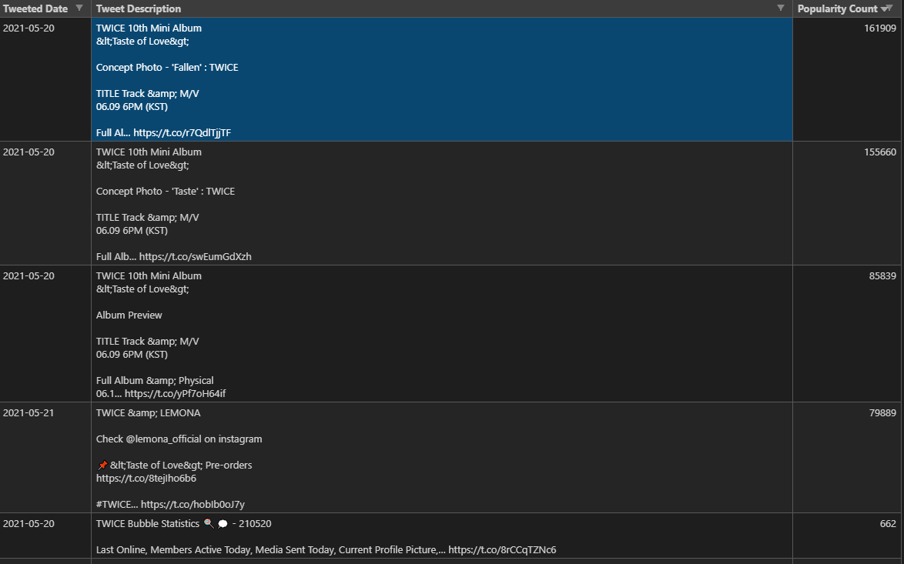

    ## Top 5 Least Popular Tweets:
    

# Resources Used: 

* Tweepy Documentation: https://docs.tweepy.org/en/latest/api.html#post-retrieve-and-engage-with-tweets

* Tweepy Github: https://github.com/tweepy/tweepy

