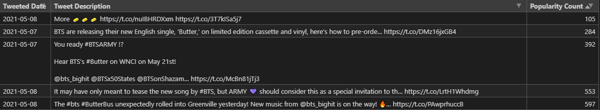

# Tweet... Tweet... Every day starts with a new feed.

* Find out my Twitter's Feed, common relationship between what I followed, and genre I am following. 

    * My Twitter's Feed is mainly about pop culture, art, media, news, games, and food.

* Discover about my Timeline, Followers, and Following's Timelines.

    * My main interests are musicians, artists, designers, museums, games, entrepreneurs, and foods.
    
    * Summary Analysis:

        
    
    * My Followings: 

        

# BTS Tweet Scraping  

* Engage tweets that talks about BTS(방탄소년단)'s new released album called, "Butter". 

    **Number 1 Popular Tweet About Butter Teaser:**

    Date       | Tweet                                                                                 | Favorite Count
    ---------- | ------------------------------------------------------------------------------------- | --------------
    2021-05-11 | #BTS #방탄소년단 #BTS_Butter Teaser Photo 1 - 정국 (Jung Kook) https://t.co/7B0ACRi2rU | 1448291 

    ---
    ## Top 5 Most Popular Tweets:

    **Popularity Count is a number of hearts counted in Twitter.**

    

    ## Top 5 Least Popular Tweets:
    

# Rain(비) Tweet Scraping 

* Engage tweets that talks about Rain's new released album called, "Switch To Me (Duet with JYP)," in Korean, 나로 바꾸자.
    
    **Top Tweet in Korean:**

    Date       | Tweet                                                                                                                                         | Favorite Count
    ---------- | --------------------------------------------------------------------------------------------------------------------------------------------- | --------------
    2021-05-11 | ".@followjyp on MelOn Daily Chart (210510) 71. When We Disco (Duet with SUNMI) — 104,050 ULs [-2] 396. Switch to me… https://t.co/tGdHgZljGf" | 21

    **Top Tweet in English:**

    Date       | Tweet                                           | Favorite Count
    ---------- | ----------------------------------------------- | --------------
    2021-05-07 | Switch to me- rain, jyp https://t.co/SGZpYLPS4Q | 83

    ---

    **Popularity Count is a number of hearts counted in Twitter.**
    
    ---

    ## Top 5 Most Popular Tweets | For search keyword results in *Korean*:
    
    

    ## Top 5 Least Popular Tweets | For search keyword results in *Korean*:
    

    ---

    ## Top 5 Most Popular Tweets | For search keyword results in *English*:

    

     ## Top 5 Least Popular Tweets | For search keyword results in *English*:
    

    - **Some of tweets are in Japanese and Korean because of the English hashtag.**
    - Because of the name "Rain" is a part of the weather climate, some unrelated tweets with the high number of hearts are included in the Top 5 and Bottom 5 Tweets.

# JYPE(박진영) Tweet Scraping 

# Sekai No Owari Tweet Scraping

### Resources Used: 

* Tweepy Documentation: https://docs.tweepy.org/en/latest/api.html#post-retrieve-and-engage-with-tweets

* Tweepy Github: https://github.com/tweepy/tweepy

