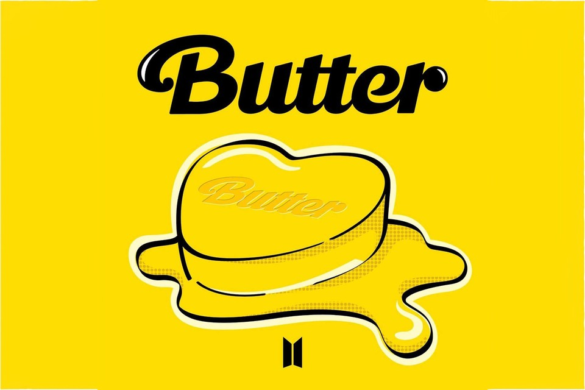

# Tweet... Tweet... Every day starts with a new feed.

* Find out my Twitter's Feed, common relationship between what I followed, and genre I am following. 

    * My Twitter's Feed is mainly about pop culture, art, media, news, games, and food.

* Discover about my Timeline, Followers, and Following's Timelines.

    * My main interests are musicians, artists, designers, museums, games, entrepreneurs, and foods.
    
    * Summary Analysis:

        
    
    * My Followings: 

        

# BTS Scraping  

* Engage tweets that talks about BTS(방탄소년단)'s new released album called, "Butter". 

    * Top 5 Most Popular Tweets:
    - 

    * Top 5 Least Popular Tweets:
    - 

# JYPE Scraping

# Rain Scraping 

# Sekai No Owari Scraping

### Resources Used: 

* Tweepy Documentation: https://docs.tweepy.org/en/latest/api.html#post-retrieve-and-engage-with-tweets

* Tweepy Github: https://github.com/tweepy/tweepy

